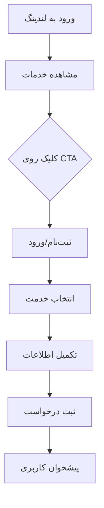

## 1. Product Overview
صفحه لندینگ سالمندیار (Salyar) - پلتفرم جامع خدمات سالمندی در ایران. این محصول به سالمندان و خانواده‌هایشان کمک می‌کند تا به راحتی به خدمات مراقبتی، درمانی و اجتماعی دسترسی پیدا کنند و کیفیت زندگی را بهبود بخشند.

هدف اصلی: ایجاد ارتباط آسان بین سالمندان، خانواده‌ها و ارائه‌دهندگان خدمات تخصصی با رابط کاربری ساده و دسترسی سریع.

## 2. Core Features

### 2.1 User Roles
| نقش کاربری | نحوه ثبت‌نام | دسترسی‌های اصلی |
|------------|---------------|------------------|
| بازدیدکننده مهمان | بدون ثبت‌نام | مشاهده اطلاعات محصول، خدمات و قیمت‌ها |
| خانواده سالمند | ثبت‌نام با موبایل | درخواست خدمات، مشاهده پرونده سالمند، پرداخت آنلاین |
| سالمند | ثبت‌نام با موبایل | دسترسی به خدمات، ارتباط با مراقب، مشاهده برنامه‌ها |
| مراقب/پرستار | ثبت‌نام + تایید هویت | مشاهده درخواست‌ها، مدیریت وقت کاری، دریافت دستمزد |

### 2.2 Feature Module
صفحه لندینگ سالمندیار شامل صفحات زیر است:
1. **صفحه اصلی (لندینگ)**: بخش هیرو با CTA، معرفی خدمات، ویژگی‌ها، نحوه کار، نظرات مشتریان، قیمت‌ها، سوالات متداول و ارتباط با ما.

### 2.3 Page Details
| نام صفحه | نام ماژول | توضیحات ویژگی |
|-----------|-----------|----------------|
| صفحه لندینگ | بخش هیرو | نمایش شعار اصلی، تصویر پس‌زمینه مرتبط با سالمندی، دکمه CTA برای شروع، منوی ناوبری چسبناک |
| صفحه لندینگ | معرفی خدمات | نمایش کارت‌های خدمات اصلی (مراقبت در منزل، مشاوره پزشکی، فعالیت‌های اجتماعی، خدمات دارویی) |
| صفحه لندینگ | ویژگی‌های کلیدی | لیست ویژگی‌ها با آیکون‌ها (امنیت بالا، پرسنل مجرب، پشتیبانی 24/7، قیمت شفاف) |
| صفحه لندینگ | نحوه کار سامانه | مراحل استفاده از خدمات به صورت گام به گام با تصاویر راهنما |
| صفحه لندینگ | نظرات مشتریان | اسلایدر یا گرید نظرات واقعی مشتریان با نام و تصویر |
| صفحه لندینگ | جدول قیمت‌ها | مقایسه پلن‌های مختلف با ویژگی‌ها و قیمت‌های شفاف |
| صفحه لندینگ | سوالات متداول | آکاردئون سوالات رایج با پاسخ‌های کامل |
| صفحه لندینگ | ارتباط با ما | فرم تماس، اطلاعات تماس، نقشه دسترسی، لینک شبکه‌های اجتماعی |
| صفحه لندینگ | فوتر | لینک‌های مهم، دانلود اپلیکیشن، خبرنامه، کپی‌رایت |

## 3. Core Process
فرآیند اصلی کاربر از ورود تا درخواست خدمت:
1. کاربر وارد صفحه لندینگ می‌شود
2. اطلاعات محصول و خدمات را مشاهده می‌کند
3. با کلیک روی CTA وارد فرم ثبت‌نام/ورود می‌شود
4. نوع خدمت مورد نیاز را انتخاب می‌کند
5. اطلاعات سالمند را وارد می‌کند
6. زمان و مکان خدمت را تعیین می‌کند
7. درخواست ثبت و پیگیری می‌شود

## 4. User Interface Design

### 4.1 Design Style
- **رنگ‌های اصلی**: آبی تیره (#1e40af) برای اعتماد و امنیت، نارنجی ملایم (#f59e0b) برای CTA و عناصر مهم
- **رنگ‌های ثانویه**: سبز (#10b981) برای موفقیت، خاکستری روشن (#f3f4f6) برای پس‌زمینه
- **استایل دکمه‌ها**: گوشه‌های گرد (8-12px)، سایه ملایم، hover effect نرم
- **فونت‌ها**: ایران‌سنس برای متون فارسی، سایزهای 16px برای بدنه، 24-32px برای تیترها
- **آیکون‌ها**: سبک فیلد (outline) با ضخامت 2px، رنگ‌های هماهنگ با برند
- **لایه‌بندی**: کارت‌محور با فاصله‌های یکنواخت، grid system 12 ستونه

### 4.2 Page Design Overview
| نام صفحه | نام ماژول | عناصر UI |
|-----------|-----------|-----------|
| لندینگ | هیرو سکشن | تصویر پس‌زمینه با overlay تیره، تیتر بزرگ فارسی، زیرنویس توضیحات، دکمه CTA برجسته، منوی همبرگری برای موبایل |
| لندینگ | خدمات | کارت‌های افقی با آیکون‌های رنگی، عنوان و توضیحات کوتاه، hover effect با scale ملایم |
| لندینگ | ویژگی‌ها | آیکون‌های دایره‌ای با پس‌زمینه رنگی، متن توضیحی زیر هر آیکون، چیدمان 2x2 در موبایل |
| لندینگ | نحوه کار | تایم‌لاین عمودی با خط اتصال، هر مرحله با عدد دایره‌ای، تصویر کوچک راهنما |
| لندینگ | نظرات | کارت‌های گرد با سایه، تصویر پروفایل گرد، نام و شهر کاربر، ریتینگ ستاره‌ای |
| لندینگ | قیمت‌ها | جدول مقایسه با border برجسته برای پلن محبوب، لیست ویژگی‌ها با تیک سبز |
| لندینگ | FAQ | آکاردئون با آیکون + و -، پاسخ‌ها با انیمیشن اسلاید dawn |
| لندینگ | تماس | فرم با فیلدهای گرد، نقشه گوگل با مارکر، آیکون‌های شبکه‌های اجتماعی |

### 4.3 Responsiveness
- **دسکتاپ-اول**: طراحی برای صفحات 1200px به بالا، سپس سازگاری با تبلت و موبایل
- **ریسپانسیو کامل**: Breakpoints در 768px و 480px، منوی همبرگری برای موبایل
- **بهینه‌سازی تاچ**: دکمه‌های بزرگ‌تر برای موبایل (حداقل 44px)، فاصله مناسب بین عناصر قابل کلیک
- **RTL کامل**: جهت راست به چپ برای تمام عناصر، جایگذاری مناسب آیکون‌ها در سمت راست متن

### 4.4 Accessibility
- **کنتراست رنگ**: نسبت کنترست حداقل 4.5:1 برای متون عادی، 3:1 برای متون بزرگ
- **فونت‌های قابل خواندن**: سایز حداقل 16px برای متون بدنه، فونت‌های بدون تزئین
- **alt text برای تصاویر**: توضیحات کامل برای تصاویر مهم، alt خالی برای تصاویر تزئینی
- **کیبورد ناویگیشن**: امکان دسترسی کامل با تب، نشانگر فوکوس واضح
- **ARIA labels**: برچسب‌های مناسب برای دکمه‌ها و لینک‌های بدون متن
- **اسکرین ریدر**: ساختار منطقی هدینگ‌ها (H1-H6)، لیست‌های مناسب برای گروه‌بندی محتوا