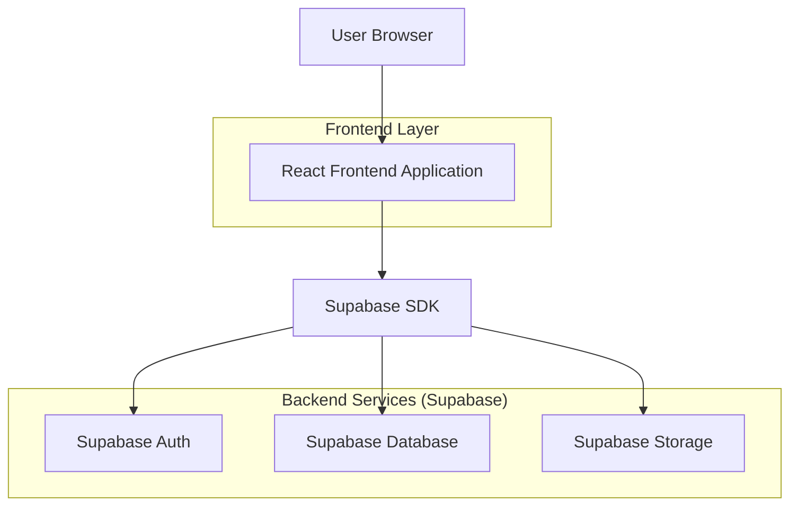
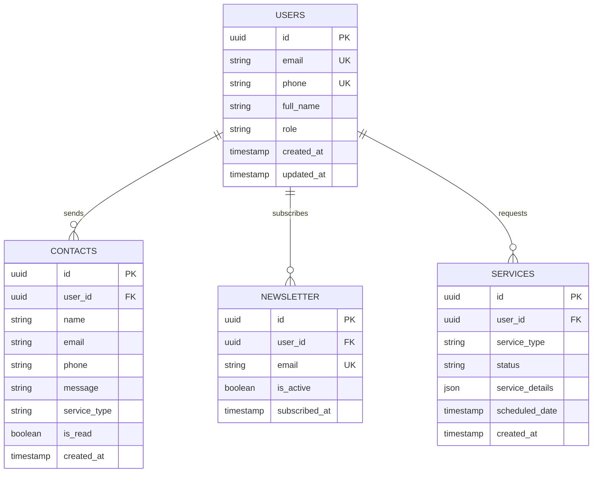

## 1. Architecture design



## 2. Technology Description

- **Frontend**: React@18 + Next.js@14 + TypeScript + Tailwind CSS
- **Initialization Tool**: create-next-app
- **Styling**: Tailwind CSS@3 + Framer Motion برای انیمیشن‌ها
- **Icons**: React Icons + Lucide React
- **Form Handling**: React Hook Form + Zod برای ولیدیشن
- **State Management**: React Context + SWR برای دیتای سرور
- **Backend**: Supabase (Authentication, Database, Storage)
- **Database**: PostgreSQL (مدیریت شده توسط Supabase)
- **Deployment**: Vercel (بهینه برای Next.js)

### 2.1 Dependencies اصلی
```json
{
  "dependencies": {
    "next": "^14.0.0",
    "react": "^18.2.0",
    "react-dom": "^18.2.0",
    "@supabase/supabase-js": "^2.38.0",
    "react-hook-form": "^7.47.0",
    "zod": "^3.22.0",
    "framer-motion": "^10.16.0",
    "react-icons": "^4.11.0",
    "lucide-react": "^0.290.0",
    "swr": "^2.2.0"
  },
  "devDependencies": {
    "typescript": "^5.2.0",
    "tailwindcss": "^3.3.0",
    "@types/node": "^20.8.0",
    "@types/react": "^18.2.0"
  }
}
```

## 3. Route definitions

| Route | Purpose |
|-------|---------|
| `/` | صفحه اصلی لندینگ با تمام بخش‌ها |
| `/auth/login` | صفحه ورود کاربران |
| `/auth/register` | صفحه ثبت‌نام کاربران جدید |
| `/dashboard` | پیشخوان کاربری پس از احراز هویت |
| `/services/[id]` | صفحه جزئیات هر خدمت |
| `/contact` | صفحه ارتباط با ما مستقل |
| `/api/contact` | API endpoint برای فرم تماس |
| `/api/newsletter` | API endpoint برای خبرنامه |

## 4. Component Architecture

### 4.1 ساختار کامپوننت‌ها
```
components/
├── layout/
│   ├── Header.tsx          // هدر با منوی ناوبری
│   ├── Footer.tsx          // فوتر با لینک‌ها و اطلاعات تماس
│   └── Navigation.tsx      // منوی اصلی ریسپانسیو
├── landing/
│   ├── Hero.tsx            // بخش هیرو با CTA
│   ├── Services.tsx        // کارت‌های خدمات
│   ├── Features.tsx        // ویژگی‌های کلیدی
│   ├── HowItWorks.tsx      // مراحل استفاده
│   ├── Testimonials.tsx    // نظرات مشتریان
│   ├── Pricing.tsx         // جدول قیمت‌ها
│   ├── FAQ.tsx            // سوالات متداول
│   └── ContactForm.tsx    // فرم تماس
├── ui/
│   ├── Button.tsx         // دکمه‌های سفارشی
│   ├── Card.tsx          // کارت‌های reusable
│   ├── Input.tsx         // اینپوت‌های فرم
│   └── Modal.tsx         // مودال‌ها
└── auth/
    ├── LoginForm.tsx     // فرم ورود
    └── RegisterForm.tsx  // فرم ثبت‌نام
```

### 4.2 State Management Structure
```typescript
// Global App Context
interface AppContext {
  user: User | null;
  isLoading: boolean;
  language: 'fa' | 'en';
  theme: 'light' | 'dark';
}

// Contact Form State
interface ContactForm {
  name: string;
  email: string;
  phone: string;
  message: string;
  serviceType: string;
}

// Newsletter State
interface Newsletter {
  email: string;
  consent: boolean;
}
```

## 5. API definitions

### 5.1 Contact Form API
```
POST /api/contact
```

Request:
| نام پارامتر | نوع | الزامی | توضیحات |
|-------------|-----|---------|----------|
| name | string | بله | نام کامل کاربر |
| email | string | بله | ایمیل معتبر |
| phone | string | بله | شماره موبایل |
| message | string | بله | متن پیام |
| serviceType | string | خیر | نوع خدمت مورد نظر |

Response:
| نام پارامتر | نوع | توضیحات |
|-------------|-----|----------|
| success | boolean | وضعیت ارسال پیام |
| message | string | پیام تأیید یا خطا |

Example:
```json
{
  "name": "علی احمدی",
  "email": "ali@example.com",
  "phone": "09123456789",
  "message": "می‌خواستم در مورد خدمات مراقبت در منزل سوال داشته باشم",
  "serviceType": "home-care"
}
```

### 5.2 Newsletter API
```
POST /api/newsletter
```

Request:
| نام پارامتر | نوع | الزامی | توضیحات |
|-------------|-----|---------|----------|
| email | string | بله | ایمیل برای خبرنامه |
| consent | boolean | بله | رضایت از دریافت ایمیل |

## 6. Data model

### 6.1 Database Schema


### 6.2 Supabase Tables DDL

#### Users Table
```sql
-- ایجاد جدول کاربران
CREATE TABLE users (
    id UUID PRIMARY KEY DEFAULT gen_random_uuid(),
    email VARCHAR(255) UNIQUE NOT NULL,
    phone VARCHAR(11) UNIQUE NOT NULL,
    full_name VARCHAR(100) NOT NULL,
    role VARCHAR(20) DEFAULT 'family' CHECK (role IN ('family', 'elderly', 'caregiver')),
    created_at TIMESTAMP WITH TIME ZONE DEFAULT NOW(),
    updated_at TIMESTAMP WITH TIME ZONE DEFAULT NOW()
);

-- ایندکس برای عملکرد بهتر
CREATE INDEX idx_users_email ON users(email);
CREATE INDEX idx_users_phone ON users(phone);
```

#### Contacts Table
```sql
-- ایجاد جدول تماس‌ها
CREATE TABLE contacts (
    id UUID PRIMARY KEY DEFAULT gen_random_uuid(),
    user_id UUID REFERENCES users(id),
    name VARCHAR(100) NOT NULL,
    email VARCHAR(255) NOT NULL,
    phone VARCHAR(11) NOT NULL,
    message TEXT NOT NULL,
    service_type VARCHAR(50),
    is_read BOOLEAN DEFAULT FALSE,
    created_at TIMESTAMP WITH TIME ZONE DEFAULT NOW()
);

-- ایندکس برای جستجو سریع
CREATE INDEX idx_contacts_created_at ON contacts(created_at DESC);
CREATE INDEX idx_contacts_is_read ON contacts(is_read);
```

#### Newsletter Table
```sql
-- ایجاد جدول خبرنامه
CREATE TABLE newsletter (
    id UUID PRIMARY KEY DEFAULT gen_random_uuid(),
    user_id UUID REFERENCES users(id),
    email VARCHAR(255) UNIQUE NOT NULL,
    is_active BOOLEAN DEFAULT TRUE,
    subscribed_at TIMESTAMP WITH TIME ZONE DEFAULT NOW()
);

-- ایندکس برای ایمیل‌های فعال
CREATE INDEX idx_newsletter_active ON newsletter(is_active) WHERE is_active = TRUE;
```

### 6.3 Security Policies

#### RLS Policies برای Contacts
```sql
-- اجازه insert برای همه (حتی کاربران ناشناس)
ALTER TABLE contacts ENABLE ROW LEVEL SECURITY;

CREATE POLICY "Anyone can send contact messages" ON contacts
    FOR INSERT WITH CHECK (true);

-- فقط کاربران احراز هویت شده می‌توانند پیام‌های خود را ببینند
CREATE POLICY "Users can view own contacts" ON contacts
    FOR SELECT USING (
        auth.uid() = user_id OR 
        EXISTS (
            SELECT 1 FROM users 
            WHERE users.email = auth.email()
        )
    );
```

#### RLS Policies برای Newsletter
```sql
-- اجازه insert برای همه
ALTER TABLE newsletter ENABLE ROW LEVEL SECURITY;

CREATE POLICY "Anyone can subscribe to newsletter" ON newsletter
    FOR INSERT WITH CHECK (true);

-- کاربران می‌توانند اشتراک خود را لغو کنند
CREATE POLICY "Users can unsubscribe" ON newsletter
    FOR UPDATE USING (auth.email() = email);
```

## 7. Performance Optimization

### 7.1 Image Optimization
- استفاده از Next.js Image component برای lazy loading خودکار
- فرمت WebP با fallback به JPEG
- سایزهای responsive برای دستگاه‌های مختلف
- CDN برای تصاویر ثابت

### 7.2 Code Splitting
- Lazy loading برای کامپوننت‌های غیرحراتی
- Dynamic import برای بخش‌های سنگین
- Bundle analyzer برای مانیتورینگ سایز

### 7.3 Caching Strategy
- Static generation برای صفحه اصلی
- ISR (Incremental Static Regeneration) برای بروزرسانی محتوا
- Browser caching برای فایل‌های ثابت
- SWR برای کش داده‌های داینامیک

## 8. Deployment Configuration

### 8.1 Environment Variables
```env
NEXT_PUBLIC_SUPABASE_URL=your_supabase_url
NEXT_PUBLIC_SUPABASE_ANON_KEY=your_anon_key
SUPABASE_SERVICE_ROLE_KEY=your_service_role_key
NEXT_PUBLIC_SITE_URL=https://salyar.ir
NEXT_PUBLIC_CONTACT_EMAIL=info@salyar.ir
```

### 8.2 Vercel Configuration
```json
{
  "buildCommand": "next build",
  "outputDirectory": ".next",
  "framework": "nextjs",
  "regions": ["fra1"],
  "env": {
    "NEXT_PUBLIC_SITE_URL": "@site_url",
    "NEXT_PUBLIC_SUPABASE_URL": "@supabase_url"
  }
}
```