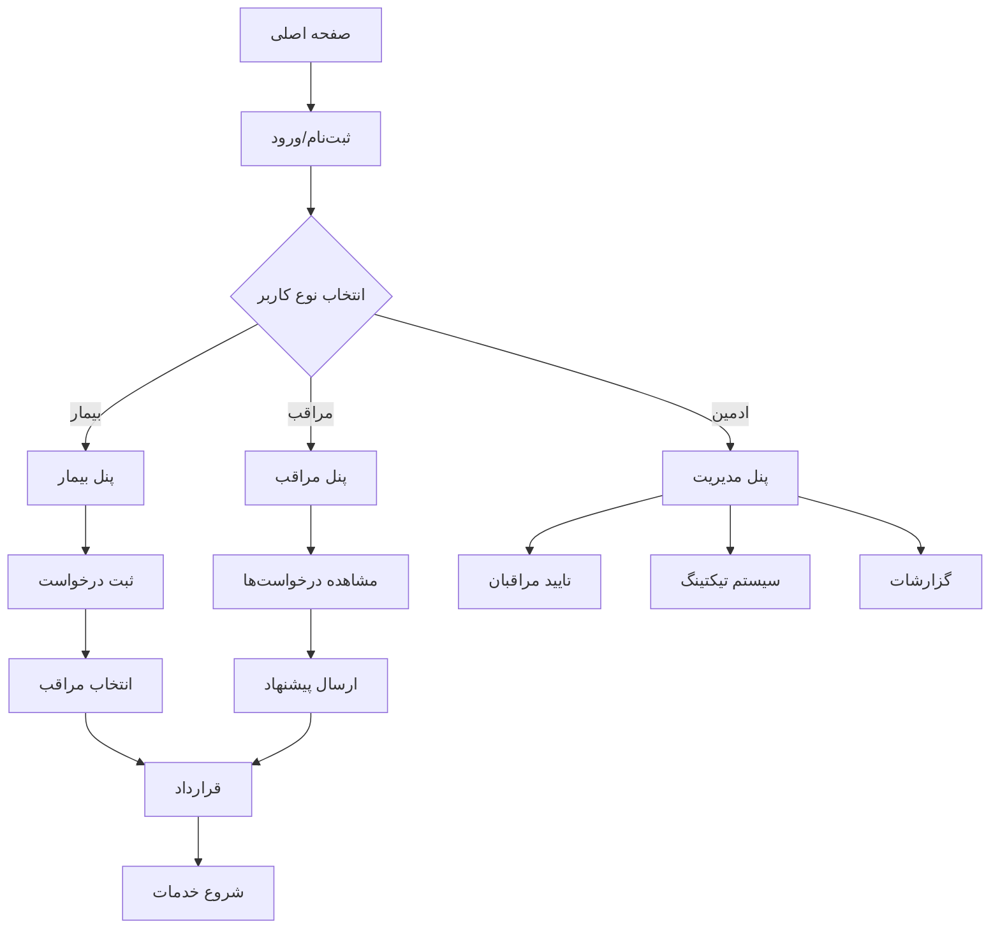

## 1. نمای کلی محصول
سالیار یک پلتفرم مراقبت از بیمار و سالمند است که خدمات مراقبتی را به صورت آنلاین به بیماران و سالمندان متصل می‌کند. این سیستم ارتباط مستقیم بین متقاضیان خدمات مراقبتی و ارائه‌دهندگان این خدمات را فراهم می‌کند.

هدف اصلی این محصول حل مشکل دسترسی سریع و آسان به مراقبان حرفه‌ای برای بیماران و سالمندان است. این سیستم برای سه گروه اصلی طراحی شده: بیماران/سالمندان، پرستاران/مراقبان، و ادمین‌های سایت.

## 2. ویژگی‌های اصلی

### 2.1 نقش‌های کاربری
| نقش | روش ثبت‌نام | دسترسی‌های اصلی |
|------|------------|------------------|
| بیمار/سالمند | ثبت‌نام با موبایل و کد ملی | ثبت درخواست خدمات، مشاهده مراقبان، ارتباط با ادمین |
| پرستار/مراقب | ثبت‌نام با مدارک حرفه‌ای | ایجاد پروفایل حرفه‌ای، مشاهده درخواست‌ها، ارسال پیشنهاد |
| سوپروایزر/ادمین | ثبت‌نام از طریق پنل مدیریت | مدیریت کاربران، تایید مراقبان، سیستم تیکتینگ، گزارش‌گیری |

### 2.2 ماژول‌های ویژگی
صفحات اصلی مورد نیاز برای محصول:
1. **صفحه اصلی**: معرفی خدمات، جستجوی مراقب، ناوبری سایت
2. **صفحه ثبت‌نام/ورود**: فرم‌های احراز هویت برای هر نوع کاربر
3. **پنل بیمار**: ثبت درخواست جدید، مشاهده درخواست‌ها، انتخاب مراقب
4. **پنل مراقب**: پروفایل حرفه‌ای، مشاهده درخواست‌ها، مدیریت پیشنهادها
5. **پنل ادمین**: مدیریت کاربران، تیکتینگ، قراردادها، گزارشات
6. **صفحه قراردادها**: نمایش و امضای قراردادهای سایت

### 2.3 محدودیت‌های هاستینگ اشتراکی ویندوز
- **سرور:** IIS با web.config برای پیکربندی
- **وظایف پس‌زمینه:** استفاده از Plesk Scheduled Tasks (CRON) برای پردازش صف
- **ذخیره‌سازی فایل:** فایل سیستم محلی یا دیتابیس (varbinary) برای پیوست‌ها
- **وب‌سوکت:** SignalR با پشتیبانی Long Polling در صورت غیرفعال بودن WebSocket
- **پایگاه‌داده:** SQL Server با محدودیت منابع

### 2.4 جزئیات صفحات
| نام صفحه | نام ماژول | توضیحات ویژگی |
|-----------|------------|-----------------|
| صفحه اصلی | بخش معرفی | نمایش خدمات اصلی، اسلایدر تصاویر، دکمه‌های CTA |
| صفحه اصلی | جستجوی مراقب | فیلتر بر اساس شهر، نوع خدمت، قیمت، امتیاز |
| صفحه اصلی | ناوبری | منوهای اصلی، لینک به ثبت‌نام، ورود، تماس |
| ثبت‌نام/ورود | فرم احراز هویت | ورود با موبایل، ثبت‌نام با کد تایید |
| پنل بیمار | ثبت درخواست | فرم جدید با نوع خدمت، تاریخ، مدت زمان، آدرس |
| پنل بیمار | مشاهده درخواست‌ها | لیست درخواست‌ها با وضعیت، پیشنهادهای دریافتی |
| پنل بیمار | انتخاب مراقب | مشاهده پروفایل مراقبان، مقایسه، انتخاب نهایی |
| پنل مراقب | پروفایل حرفه‌ای | اطلاعات شخصی، مدارک، تجربه، قیمت‌ها، نمونه کارها |
| پنل مراقب | مشاهده درخواست‌ها | فیلتر درخواست‌ها بر اساس موقعیت، نوع خدمت |
| پنل مراقب | مدیریت پیشنهادها | ارسال پیشنهاد، پیگیری وضعیت، مذاکره قیمت |
| پنل ادمین | مدیریت کاربران | جستجو، فیلتر، تایید/رد مراقبان، مسدودسازی |
| پنل ادمین | سیستم تیکتینگ | ایجاد تیکت، پاسخ‌گویی، دسته‌بندی (مالی، پشتیبانی، شکایات)، اولویت‌بندی (کم، متوسط، بالا، بحرانی)، وضعیت (جدید، باز، در انتظار کاربر، در انتظار ادمین، حل‌شده، بسته‌شده)، یادداشت‌های داخلی، انتساب به دپارتمان |
| پنل ادمین | گزارشات | آمار کاربران، درآمد، درخواست‌ها، نمودارها |
| صفحه قراردادها | نمایش قرارداد | متن قرارداد، شرایط و قوانین، تاریخ اعتبار |
| صفحه قراردادها | امضای دیجیتال | تایید و امضای الکترونیکی قرارداد توسط طرفین |
| پنل تیکت کاربر | لیست تیکت‌ها | نمایش تیکت‌های فعال با وضعیت و آخرین بروزرسانی |
| پنل تیکت کاربر | مکالمه تیکت | ارسال پیام جدید، مشاهده تاریخچه، پیوست فایل (تصویر/PDF) |
| پنل تیکت ادمین | داشبورد تیکت‌ها | فیلتر بر اساس دسته، اولویت، وضعیت، دپارتمان |
| پنل تیکت ادمین | مدیریت تیکت | تغییر وضعیت، اختصاص به دپارتمان، افزودن یادداشت داخلی |
| اعلانات | ایمیل/اس‌ام‌اس | اطلاع‌رسانی تغییر وضعیت تیکت، پاسخ جدید |

## 3. فرآیند اصلی
### فرآیند بیمار:
1. بیمار وارد سایت شده و ثبت‌نام می‌کند
2. درخواست خدمات جدید ثبت می‌کند با مشخصات کامل
3. منتظر دریافت پیشنهاد از مراقبان می‌ماند
4. پیشنهادها را بررسی کرده و مراقب مناسب انتخاب می‌کند
5. قرارداد منعقد شده و خدمات آغاز می‌شود

### فرآیند مراقب:
1. مراقب ثبت‌نام کرده و مدارک خود را بارگذاری می‌کند
2. پس از تایید ادمین، پروفایل حرفه‌ای کامل می‌کند
3. درخواست‌های مناسب را مشاهده و پیشنهاد ارسال می‌کند
4. پس از قبول پیشنهاد، قرارداد را امضا می‌کند
5. خدمات مراقبتی را ارائه می‌دهد

### فرآیند ادمین:
1. درخواست‌های ثبت‌نام مراقبان را بررسی و تایید می‌کند
2. تیکت‌های پشتیبانی کاربران را پاسخ می‌دهد
3. گزارشات عملکرد و آمار را مشاهده می‌کند
4. در صورت لزوم مستقیماً با کاربران ارتباط برقرار می‌کند

## 4. طراحی رابط کاربری
### 4.1 سبک طراحی
- رنگ‌های اصلی: آبی تیره (#1e40af) برای اعتماد، سبز (#059669) برای سلامت
- رنگ‌های ثانویه: خاکستری روشن (#f3f4f6) برای پس‌زمینه، سفید برای کارت‌ها
- دکمه‌ها: گوشه‌های گرد (8px)، سایه ملایم، حالت هاور
- فونت: ایران‌سنس برای فارسی، سایزهای 14px برای متن، 16px برای عنوان
- سبک چیدمان: کارت‌محور با فاصله‌گذاری مناسب، ناوبری بالایی چسبان
- آیکون‌ها: سبک فلت با رنگ‌های یکدست، از مجموعه آیکون‌های سلامت

### 4.2 بررسی طراحی صفحات
| نام صفحه | نام ماژول | عناصر رابط کاربری |
|-----------|------------|-------------------|
| صفحه اصلی | بخش معرفی | اسلایدر تمام‌صفحه با تصاویر مراقبت، تیتر بزرگ با فونت 32px |
| صفحه اصلی | جستجوی مراقب | کارت‌های افقی با تصویر پروفایل، امتیاز ستاره‌ای، دکمه مشاهده |
| پنل بیمار | ثبت درخواست | فرم چندمرحله‌ای با نوار پیشرفت، فیلدهای واضح با برچسب فارسی |
| پنل مراقب | پروفایل | کارت اطلاعات با آیکون‌های مناسب، گالری تصاویر نمونه کارها |
| پنل ادمین | جدول کاربران | جدول واکنش‌گرا با امکان مرتب‌سازی، دکمه‌های عملیات کوچک |

### 4.3 واکنش‌گرایی
طراحی به‌صورت دسکتاپ-محور انجام می‌شود اما کاملاً واکنش‌گرا خواهد بود:
- نسخه موبایل: منوی همبرگری، کارت‌های عمودی، فونت‌های بزرگ‌تر
- نسخه تبلت: ستون‌های انعطاف‌پذیر، فاصله‌گذاری تنظیم‌شده
- بهینه‌سازی برای تاچ: دکمه‌های بزرگ‌تر، فاصله مناسب بین عناصر قابل کلیک

### 4.4 راهنمای صحنه‌های 3D (در صورت نیاز)
در صورت افزودن عناصر 3D برای جذابیت بصری:
- محیط: استودیوی پزشکی با نوردهی ملایم، رنگ‌های سفید و آبی
- نورپردازی: نور اصلی از بالا، نور پرکننده از جلو، سایه‌های نرم
- دوربین: زاویه دید 60 درجه، موقعیت ثابت با امکان چرخش ملایم
- ترکیب‌بندی: عناصر اصلی در پیش‌زمینه، پس‌زمینه تمیز با الگوهای ساده
- تعامل: انیمیشن‌های هاور با تغییر رنگ، چرخش ملایم در حالت بیکار