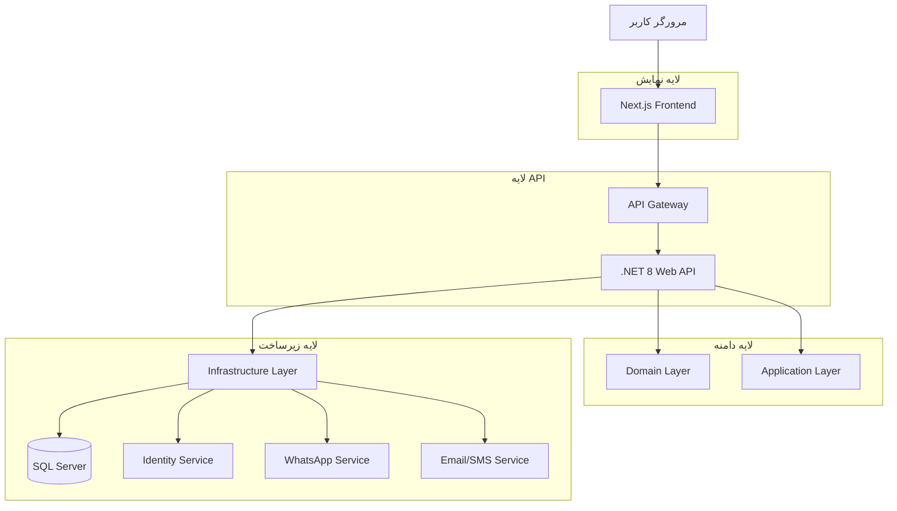
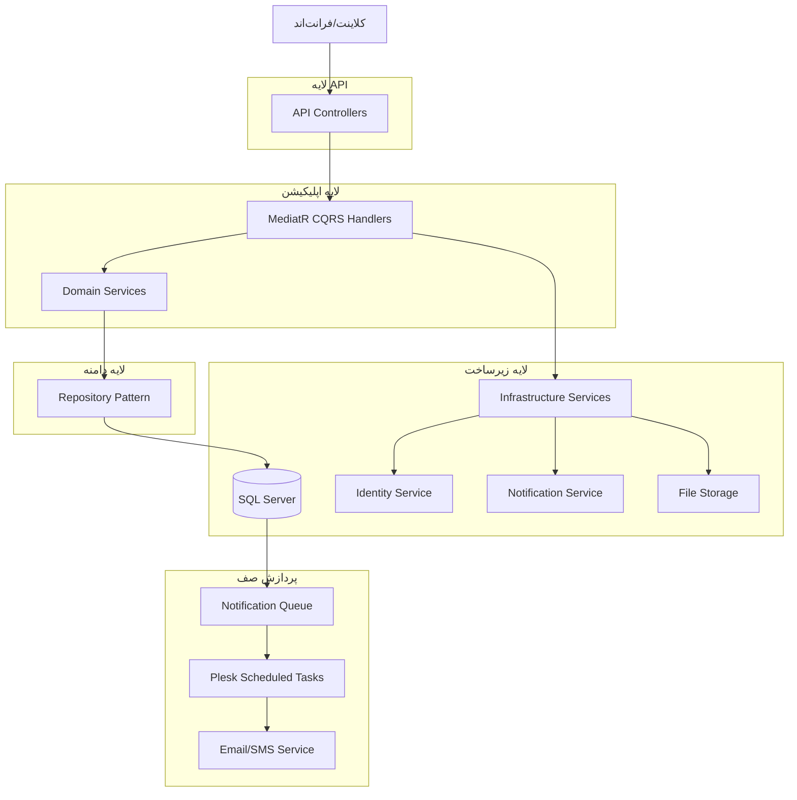
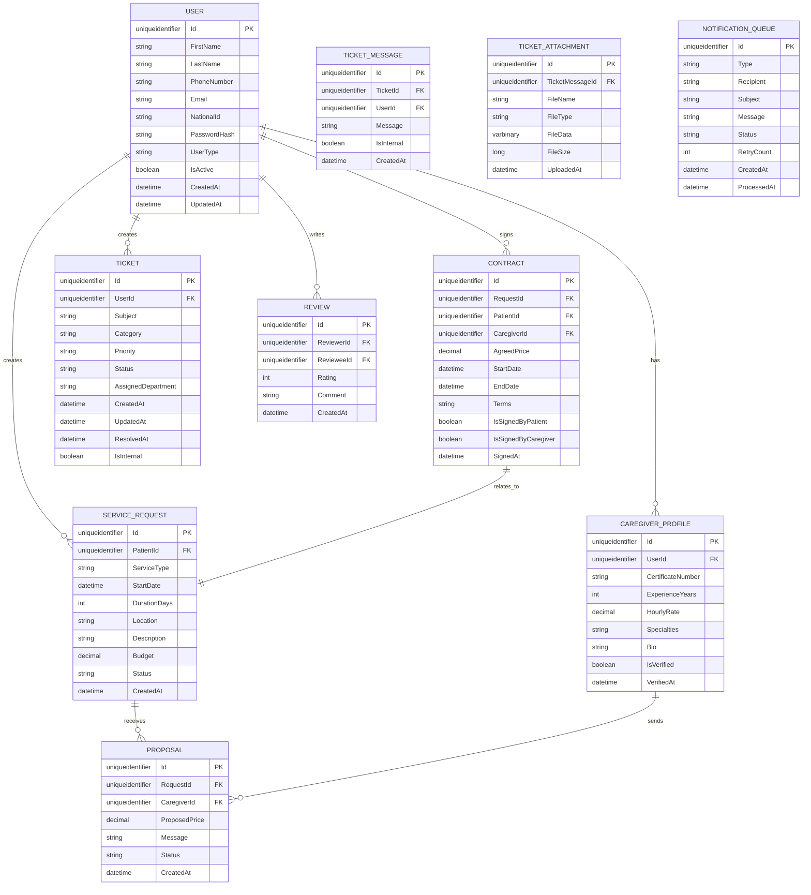

## 1. طراحی معماری



## 2. توضیحات فناوری

* **فرانت‌اند:** Next.js 14 + React 18 + TypeScript + Tailwind CSS

* **ابزار راه‌اندازی:** create-next-app

* **بک‌اند:** .NET 8 Web API + C#

* **معماری:** Clean Architecture + Domain-Driven Design (DDD)

* **هاستینگ:** IIS + Windows Shared Hosting + Plesk Control Panel

* **پردازش صف:** Database-backed queue + Plesk Scheduled Tasks (CRON)

* **ذخیره‌سازی فایل:** Local file system + Database varbinary for attachments

* **پایگاه‌داده:** SQL Server 2022

* **احراز هویت:** ASP.NET Core Identity + JWT Bearer Token

* **ORM:** Entity Framework Core 8

* **ارتباط:** REST API + SignalR (برای اعلان‌های زنده)

## 3. تعاریف مسیرها

### مسیرهای فرانت‌اند (Next.js)

| مسیر                 | هدف                            |
| -------------------- | ------------------------------ |
| /                    | صفحه اصلی، نمایش خدمات و جستجو |
| /auth/login          | صفحه ورود کاربران              |
| /auth/register       | صفحه ثبت‌نام، انتخاب نوع کاربر |
| /patient/dashboard   | پنل بیمار، مدیریت درخواست‌ها   |
| /patient/requests    | ثبت و مشاهده درخواست‌های خدمات |
| /caregiver/dashboard | پنل مراقب، مدیریت پروفایل      |
| /caregiver/profile   | ویرایش پروفایل حرفه‌ای         |
| /caregiver/requests  | مشاهده درخواست‌های دریافتی     |
| /admin/dashboard     | پنل مدیریت، آمار و گزارشات     |
| /admin/users         | مدیریت کاربران                 |
| /admin/tickets       | سیستم تیکتینگ پشتیبانی         |
| /contracts           | نمایش و امضای قراردادها        |
| /profile             | پروفایل کاربری عمومی           |

### مسیرهای API (ASP.NET Core)

| مسیر               | هدف                |
| ------------------ | ------------------ |
| /api/auth/\*       | مسیرهای احراز هویت |
| /api/patients/\*   | مدیریت بیماران     |
| /api/caregivers/\* | مدیریت مراقبان     |
| /api/requests/\*   | مدیریت درخواست‌ها  |
| /api/contracts/\*  | مدیریت قراردادها   |
| /api/tickets/\*    | سیستم تیکتینگ      |
| /api/admin/\*      | عملیات مدیریتی     |

## 4. تعاریف API

### 4.1 API های اصلی احراز هویت

#### ثبت‌نام کاربر جدید

```
POST /api/auth/register
```

درخواست:

| نام پارامتر | نوع پارامتر | اجباری | توضیحات                               |
| ----------- | ----------- | ------ | ------------------------------------- |
| firstName   | string      | true   | نام                                   |
| lastName    | string      | true   | نام خانوادگی                          |
| phoneNumber | string      | true   | شماره موبایل                          |
| email       | string      | true   | ایمیل                                 |
| password    | string      | true   | رمز عبور                              |
| userType    | string      | true   | نوع کاربر (Patient, Caregiver, Admin) |
| nationalId  | string      | true   | کد ملی                                |

پاسخ:

| نام پارامتر | نوع پارامتر | توضیحات      |
| ----------- | ----------- | ------------ |
| success     | boolean     | وضعیت عملیات |
| message     | string      | پیغام نتیجه  |
| userId      | string      | شناسه کاربر  |

#### ورود کاربر

```
POST /api/auth/login
```

درخواست:

| نام پارامتر | نوع پارامتر | اجباری | توضیحات      |
| ----------- | ----------- | ------ | ------------ |
| phoneNumber | string      | true   | شماره موبایل |
| password    | string      | true   | رمز عبور     |

پاسخ:

| نام پارامتر  | نوع پارامتر | توضیحات        |
| ------------ | ----------- | -------------- |
| success      | boolean     | وضعیت عملیات   |
| token        | string      | JWT توکن       |
| refreshToken | string      | توکن تازه‌سازی |
| user         | object      | اطلاعات کاربر  |

### 4.2 API های درخواست خدمات

#### ثبت درخواست جدید

```
POST /api/requests/create
```

درخواست:

| نام پارامتر | نوع پارامتر | اجباری | توضیحات            |
| ----------- | ----------- | ------ | ------------------ |
| serviceType | string      | true   | نوع خدمت مورد نیاز |
| startDate   | datetime    | true   | تاریخ شروع         |
| duration    | int         | true   | مدت زمان (روز)     |
| location    | object      | true   | آدرس محل خدمت      |
| description | string      | false  | توضیحات تکمیلی     |
| budget      | decimal     | false  | بودجه پیشنهادی     |

#### دریافت پیشنهادات برای درخواست

```
GET /api/requests/{requestId}/proposals
```

پاسخ:

| نام پارامتر   | نوع پارامتر | توضیحات                |
| ------------- | ----------- | ---------------------- |
| proposals     | array       | لیست پیشنهادات دریافتی |
| caregiverInfo | object      | اطلاعات مراقب          |
| price         | decimal     | قیمت پیشنهادی          |
| message       | string      | پیغام همراه            |

### 4.3 API های سیستم تیکتینگ

#### ایجاد تیکت جدید

```
POST /api/tickets/create
```

درخواست:

| نام پارامتر | نوع پارامتر | اجباری | توضیحات                            |
| ----------- | ----------- | ------ | ---------------------------------- |
| subject     | string      | true   | موضوع تیکت                         |
| category    | string      | true   | دسته‌بندی (مالی، پشتیبانی، شکایات) |
| priority    | string      | true   | اولویت (کم، متوسط، بالا، بحرانی)   |
| message     | string      | true   | متن پیام اولیه                     |
| attachments | array       | false  | فایل‌های پیوست (تصویر/PDF)         |

#### ارسال پاسخ به تیکت

```
POST /api/tickets/{ticketId}/reply
```

درخواست:

| نام پارامتر | نوع پارامتر | اجباری | توضیحات               |
| ----------- | ----------- | ------ | --------------------- |
| message     | string      | true   | متن پاسخ              |
| isInternal  | boolean     | false  | آیا یادداشت داخلی است |
| attachments | array       | false  | فایل‌های پیوست        |

#### بروزرسانی وضعیت تیکت

```
PUT /api/tickets/{ticketId}/status
```

درخواست:

| نام پارامتر        | نوع پارامتر | اجباری | توضیحات                                                                    |
| ------------------ | ----------- | ------ | -------------------------------------------------------------------------- |
| status             | string      | true   | وضعیت جدید (جدید، باز، در انتظار کاربر، در انتظار ادمین، حل‌شده، بسته‌شده) |
| assignedDepartment | string      | false  | دپارتمان منتسب‌شده                                                         |
| notes              | string      | false  | یادداشت‌های ادمین                                                          |

#### دریافت لیست تیکت‌ها

```
GET /api/tickets/list
```

پارامترهای کوئری:

| نام پارامتر | نوع پارامتر | اجباری | توضیحات                 |
| ----------- | ----------- | ------ | ----------------------- |
| status      | string      | false  | فیلتر بر اساس وضعیت     |
| category    | string      | false  | فیلتر بر اساس دسته‌بندی |
| priority    | string      | false  | فیلتر بر اساس اولویت    |
| department  | string      | false  | فیلتر بر اساس دپارتمان  |
| page        | int         | false  | شماره صفحه              |
| pageSize    | int         | false  | اندازه صفحه             |

## 5. پیکربندی IIS (web.config)

```xml
<?xml version="1.0" encoding="utf-8"?>
<configuration>
  <system.webServer>
    <rewrite>
      <rules>
        <!-- Handle React Router -->
        <rule name="React Routes" stopProcessing="true">
          <match url=".*" />
          <conditions logicalGrouping="MatchAll">
            <add input="{REQUEST_FILENAME}" matchType="IsFile" negate="true" />
            <add input="{REQUEST_FILENAME}" matchType="IsDirectory" negate="true" />
            <add input="{REQUEST_URI}" pattern="^/(api)" negate="true" />
          </conditions>
          <action type="Rewrite" url="/" />
        </rule>
      </rules>
    </rewrite>
    
    <security>
      <requestFiltering>
        <!-- File upload limits -->
        <requestLimits maxAllowedContentLength="104857600" /> <!-- 100MB -->
      </requestFiltering>
    </security>
    
    <staticContent>
      <!-- Cache static files -->
      <clientCache cacheControlMode="UseMaxAge" cacheControlMaxAge="7.00:00:00" />
    </staticContent>
    
    <httpCompression enabled="true" />
    
    <httpProtocol>
      <customHeaders>
        <add name="X-Frame-Options" value="DENY" />
        <add name="X-Content-Type-Options" value="nosniff" />
        <add name="X-XSS-Protection" value="1; mode=block" />
      </customHeaders>
    </httpProtocol>
  </system.webServer>
  
  <system.web>
    <httpRuntime maxRequestLength="102400" executionTimeout="3600" />
    <compilation debug="false" targetFramework="4.8" />
  </system.web>
  
  <connectionStrings>
    <add name="DefaultConnection" 
         connectionString="Data Source=localhost;Initial Catalog=SalyarDB;Integrated Security=true;" 
         providerName="System.Data.SqlClient" />
  </connectionStrings>
</configuration>
```

## 6. نمودار معماری سرور



## 7. نکات محیط هاستینگ

* **IIS نسخه 10+** با پشتیبانی از .NET 8

* **SQL Server 2019+** با محدودیت حجم داده‌ها

* **Plesk Scheduled Tasks** برای اجرای هر 5 دقیقه صف اعلانات

* **فضای دیسک:** حداقل 1GB برای برنامه + فضای پیوست‌ها

* **حافظه:** حداقل 512MB RAM برای پردازش صف

* **SSL:** گواهینامه رایگان Let's Encrypt از طریق Plesk

* **پشتیبان‌گیری:** خودکار هفتگی توسط پلسک

## 8. مدل داده

### 8.1 تعریف مدل داده



### 8.2 زبان تعریف داده (DDL)

#### جدول کاربران (Users)

```sql
-- ایجاد جدول کاربران
CREATE TABLE Users (
    Id UNIQUEIDENTIFIER PRIMARY KEY DEFAULT NEWID(),
    FirstName NVARCHAR(50) NOT NULL,
    LastName NVARCHAR(50) NOT NULL,
    PhoneNumber NVARCHAR(11) UNIQUE NOT NULL,
    Email NVARCHAR(100) UNIQUE,
    NationalId NVARCHAR(10) UNIQUE NOT NULL,
    PasswordHash NVARCHAR(500) NOT NULL,
    UserType NVARCHAR(20) NOT NULL CHECK (UserType IN ('Patient', 'Caregiver', 'Admin')),
    IsActive BIT DEFAULT 1,
    CreatedAt DATETIME2 DEFAULT GETUTCDATE(),
    UpdatedAt DATETIME2 DEFAULT GETUTCDATE()
);

-- ایندکس‌ها برای عملکرد بهتر
CREATE INDEX IX_Users_PhoneNumber ON Users(PhoneNumber);
CREATE INDEX IX_Users_NationalId ON Users(NationalId);
CREATE INDEX IX_Users_UserType ON Users(UserType);
CREATE INDEX IX_Users_IsActive ON Users(IsActive);
```

#### جدول پروفایل مراقبان (CaregiverProfiles)

```sql
-- ایجاد جدول پروفایل مراقبان
CREATE TABLE CaregiverProfiles (
    Id UNIQUEIDENTIFIER PRIMARY KEY DEFAULT NEWID(),
    UserId UNIQUEIDENTIFIER NOT NULL,
    CertificateNumber NVARCHAR(50),
    ExperienceYears INT DEFAULT 0,
    HourlyRate DECIMAL(10,2),
    Specialties NVARCHAR(500),
    Bio NVARCHAR(1000),
    IsVerified BIT DEFAULT 0,
    VerifiedAt DATETIME2,
    CreatedAt DATETIME2 DEFAULT GETUTCDATE(),
    UpdatedAt DATETIME2 DEFAULT GETUTCDATE(),
    CONSTRAINT FK_CaregiverProfiles_Users FOREIGN KEY (UserId) REFERENCES Users(Id)
);

CREATE INDEX IX_CaregiverProfiles_UserId ON CaregiverProfiles(UserId);
CREATE INDEX IX_CaregiverProfiles_IsVerified ON CaregiverProfiles(IsVerified);
```

#### جدول درخواست‌های خدمات (ServiceRequests)

```sql
-- ایجاد جدول درخواست‌های خدمات
CREATE TABLE ServiceRequests (
    Id UNIQUEIDENTIFIER PRIMARY KEY DEFAULT NEWID(),
    PatientId UNIQUEIDENTIFIER NOT NULL,
    ServiceType NVARCHAR(100) NOT NULL,
    StartDate DATETIME2 NOT NULL,
    DurationDays INT NOT NULL,
    Location NVARCHAR(500) NOT NULL,
    Description NVARCHAR(1000),
    Budget DECIMAL(10,2),
    Status NVARCHAR(20) DEFAULT 'Pending' CHECK (Status IN ('Pending', 'Active', 'Completed', 'Cancelled')),
    CreatedAt DATETIME2 DEFAULT GETUTCDATE(),
    UpdatedAt DATETIME2 DEFAULT GETUTCDATE(),
    CONSTRAINT FK_ServiceRequests_Users FOREIGN KEY (PatientId) REFERENCES Users(Id)
);

CREATE INDEX IX_ServiceRequests_PatientId ON ServiceRequests(PatientId);
CREATE INDEX IX_ServiceRequests_Status ON ServiceRequests(Status);
CREATE INDEX IX_ServiceRequests_ServiceType ON ServiceRequests(ServiceType);
CREATE INDEX IX_ServiceRequests_CreatedAt ON ServiceRequests(CreatedAt DESC);
```

#### جدول پیشنهادات (Proposals)

```sql
-- ایجاد جدول پیشنهادات
CREATE TABLE Proposals (
    Id UNIQUEIDENTIFIER PRIMARY KEY DEFAULT NEWID(),
    RequestId UNIQUEIDENTIFIER NOT NULL,
    CaregiverId UNIQUEIDENTIFIER NOT NULL,
    ProposedPrice DECIMAL(10,2) NOT NULL,
    Message NVARCHAR(500),
    Status NVARCHAR(20) DEFAULT 'Pending' CHECK (Status IN ('Pending', 'Accepted', 'Rejected')),
    CreatedAt DATETIME2 DEFAULT GETUTCDATE(),
    UpdatedAt DATETIME2 DEFAULT GETUTCDATE(),
    CONSTRAINT FK_Proposals_ServiceRequests FOREIGN KEY (RequestId) REFERENCES ServiceRequests(Id),
    CONSTRAINT FK_Proposals_Users FOREIGN KEY (CaregiverId) REFERENCES Users(Id)
);

CREATE INDEX IX_Proposals_RequestId ON Proposals(RequestId);
CREATE INDEX IX_Proposals_CaregiverId ON Proposals(CaregiverId);
CREATE INDEX IX_Proposals_Status ON Proposals(Status);
```

#### جدول قراردادها (Contracts)

````sql
-- ایجاد جدول قراردادها
CREATE TABLE Contracts (
    Id UNIQUEIDENTIFIER PRIMARY KEY DEFAULT NEWID(),
    RequestId UNIQUEIDENTIFIER NOT NULL,
    PatientId UNIQUEIDENTIFIER NOT NULL,
    CaregiverId UNIQUEIDENTIFIER NOT NULL,
    AgreedPrice DECIMAL(10,2) NOT NULL,
    StartDate DATETIME2 NOT NULL,
    EndDate DATETIME2 NOT NULL,
    Terms NVARCHAR(2000),
    IsSignedByPatient BIT DEFAULT 0,
    IsSignedByCaregiver BIT DEFAULT 0,
    SignedAt DATETIME2,
    CreatedAt DATETIME2 DEFAULT GETUTCDATE(),
    CONSTRAINT FK_Contracts_ServiceRequests FOREIGN KEY (RequestId) REFERENCES ServiceRequests(Id),
    CONSTRAINT FK_Contracts_Patient FOREIGN KEY (PatientId) REFERENCES Users(Id),
    CONSTRAINT FK_Contracts_Caregiver FOREIGN KEY (CaregiverId) REFERENCES Users(Id)
);

CREATE INDEX IX_Contracts_RequestId ON Contracts(RequestId);
CREATE INDEX IX_Contracts_PatientId ON Contracts(PatientId);
CREATE INDEX IX_Contracts_CaregiverId ON Contracts(CaregiverId);

#### جدول تیکت‌ها (Tickets)
```sql
-- ایجاد جدول تیکت‌ها
CREATE TABLE Tickets (
    Id UNIQUEIDENTIFIER PRIMARY KEY DEFAULT NEWID(),
    UserId UNIQUEIDENTIFIER NOT NULL,
    Subject NVARCHAR(200) NOT NULL,
    Category NVARCHAR(50) NOT NULL CHECK (Category IN ('مالی', 'پشتیبانی', 'شکایات')),
    Priority NVARCHAR(20) NOT NULL CHECK (Priority IN ('کم', 'متوسط', 'بالا', 'بحرانی')),
    Status NVARCHAR(30) NOT NULL CHECK (Status IN ('جدید', 'باز', 'در انتظار کاربر', 'در انتظار ادمین', 'حل‌شده', 'بسته‌شده')),
    AssignedDepartment NVARCHAR(50),
    CreatedAt DATETIME2 DEFAULT GETUTCDATE(),
    UpdatedAt DATETIME2 DEFAULT GETUTCDATE(),
    ResolvedAt DATETIME2,
    CONSTRAINT FK_Tickets_Users FOREIGN KEY (UserId) REFERENCES Users(Id)
);

CREATE INDEX IX_Tickets_UserId ON Tickets(UserId);
CREATE INDEX IX_Tickets_Status ON Tickets(Status);
CREATE INDEX IX_Tickets_Category ON Tickets(Category);
CREATE INDEX IX_Tickets_Priority ON Tickets(Priority);
CREATE INDEX IX_Tickets_AssignedDepartment ON Tickets(AssignedDepartment);
CREATE INDEX IX_Tickets_CreatedAt ON Tickets(CreatedAt DESC);
````

#### جدول پیام‌های تیکت (TicketMessages)

```sql
-- ایجاد جدول پیام‌های تیکت
CREATE TABLE TicketMessages (
    Id UNIQUEIDENTIFIER PRIMARY KEY DEFAULT NEWID(),
    TicketId UNIQUEIDENTIFIER NOT NULL,
    UserId UNIQUEIDENTIFIER NOT NULL,
    Message NVARCHAR(2000) NOT NULL,
    IsInternal BIT DEFAULT 0,
    CreatedAt DATETIME2 DEFAULT GETUTCDATE(),
    CONSTRAINT FK_TicketMessages_Tickets FOREIGN KEY (TicketId) REFERENCES Tickets(Id),
    CONSTRAINT FK_TicketMessages_Users FOREIGN KEY (UserId) REFERENCES Users(Id)
);

CREATE INDEX IX_TicketMessages_TicketId ON TicketMessages(TicketId);
CREATE INDEX IX_TicketMessages_UserId ON TicketMessages(UserId);
CREATE INDEX IX_TicketMessages_CreatedAt ON TicketMessages(CreatedAt);
```

#### جدول پیوست‌های تیکت (TicketAttachments)

```sql
-- ایجاد جدول پیوست‌های تیکت
CREATE TABLE TicketAttachments (
    Id UNIQUEIDENTIFIER PRIMARY KEY DEFAULT NEWID(),
    TicketMessageId UNIQUEIDENTIFIER NOT NULL,
    FileName NVARCHAR(255) NOT NULL,
    FileType NVARCHAR(50) NOT NULL,
    FileData VARBINARY(MAX) NOT NULL,
    FileSize BIGINT NOT NULL,
    UploadedAt DATETIME2 DEFAULT GETUTCDATE(),
    CONSTRAINT FK_TicketAttachments_TicketMessages FOREIGN KEY (TicketMessageId) REFERENCES TicketMessages(Id)
);

CREATE INDEX IX_TicketAttachments_TicketMessageId ON TicketAttachments(TicketMessageId);
CREATE INDEX IX_TicketAttachments_FileType ON TicketAttachments(FileType);
```

#### جدول صف اعلانات (NotificationQueue)

```sql
-- ایجاد جدول صف اعلانات برای پردازش با Plesk Scheduled Tasks
CREATE TABLE NotificationQueue (
    Id UNIQUEIDENTIFIER PRIMARY KEY DEFAULT NEWID(),
    Type NVARCHAR(20) NOT NULL CHECK (Type IN ('Email', 'SMS')),
    Recipient NVARCHAR(100) NOT NULL,
    Subject NVARCHAR(200),
    Message NVARCHAR(1000) NOT NULL,
    Status NVARCHAR(20) DEFAULT 'Pending' CHECK (Status IN ('Pending', 'Processing', 'Sent', 'Failed')),
    RetryCount INT DEFAULT 0,
    CreatedAt DATETIME2 DEFAULT GETUTCDATE(),
    ProcessedAt DATETIME2,
    ErrorMessage NVARCHAR(500)
);

CREATE INDEX IX_NotificationQueue_Status ON NotificationQueue(Status);
CREATE INDEX IX_NotificationQueue_CreatedAt ON NotificationQueue(CreatedAt);
CREATE INDEX IX_NotificationQueue_RetryCount ON NotificationQueue(RetryCount);
```

````

#### داده‌های اولیه برای تست
```sql
-- درج داده‌های تست برای ادمین
INSERT INTO Users (Id, FirstName, LastName, PhoneNumber, Email, NationalId, PasswordHash, UserType, IsActive)
VALUES (
    NEWID(), 
    'ادمین', 
    'سیستم', 
    '09123456789', 
    'admin@salyar.com', 
    '1234567890', 
    'AQAAAAEAACcQAAAAEEXAMPLE_HASH', 
    'Admin', 
    1
);

-- درج داده‌های تست برای تنظیمات سیستم
INSERT INTO Settings (Key, Value, Description)
VALUES 
('SiteName', 'سالیار', 'نام سایت'),
('ContactPhone', '021-12345678', 'شماره تماس پشتیبانی'),
('WhatsAppNumber', '09123456789', 'شماره واتساپ پشتیبانی'),
('ContractTerms', 'شرایط عمومی قرارداد...', 'متن قرارداد پیش‌فرض');
````

